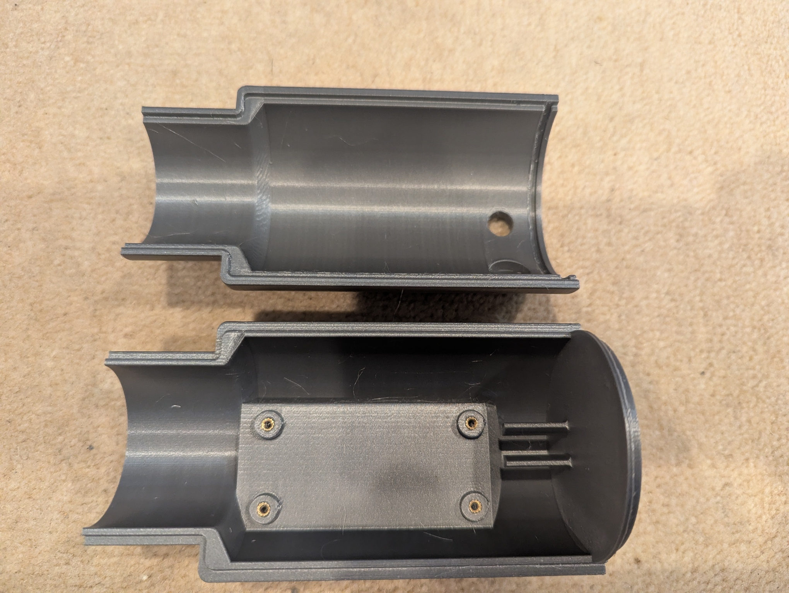
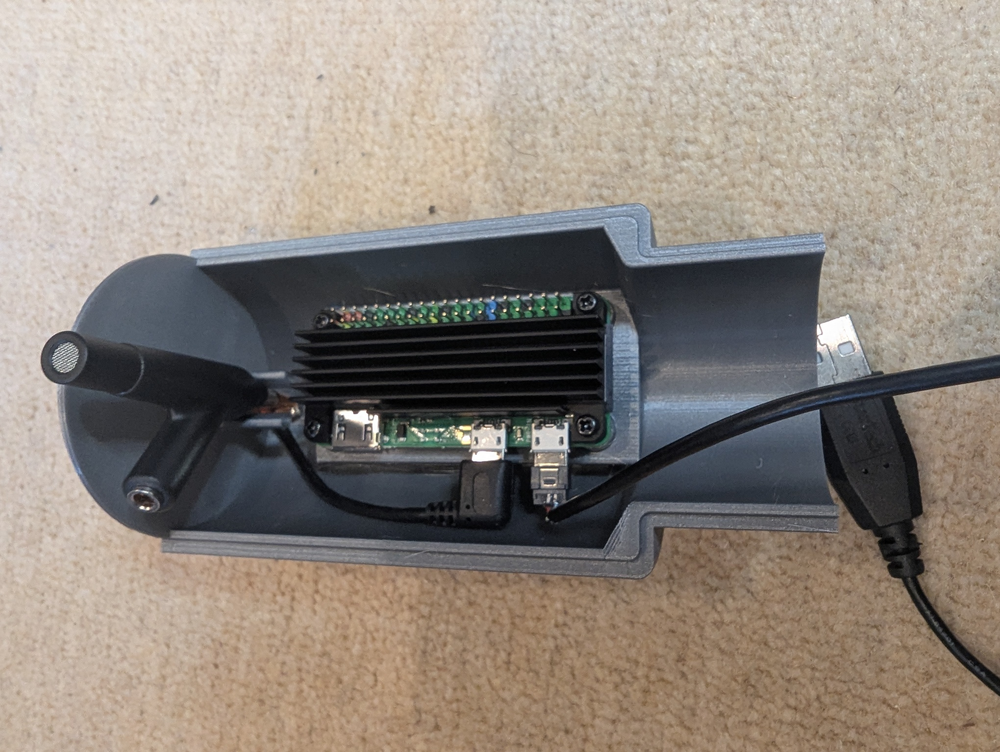
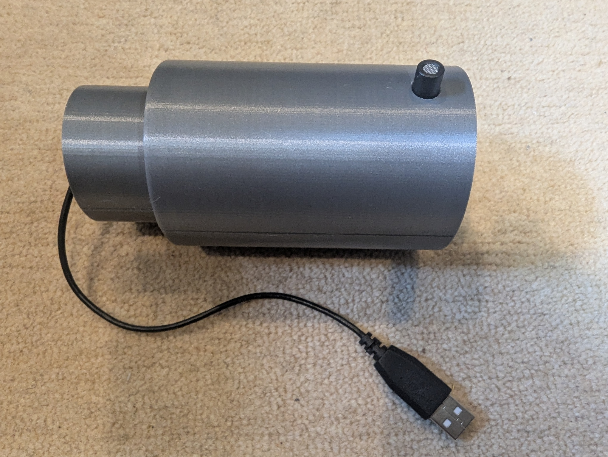

# Audio Classification of Aircraft

**WIP**

## Hardware

### ADS-B Metadata Capture (Rpi4B)

See my [ADS-B Receiver Monitor](https://github.com/jduanen/ADSBMonitor) repo for the hardware used to generate the ADS-B metadata this project's training data.

### Flyover Audio Capture (RPi0-2W)

* RPi0-2W
  - added heat sink to RPi0-2W

* Microphone and ADC
  - Dayton Audio iMM-6C, USB-C calibrated microphone, 6mm condenser, CM6542
  - omnidirectional
  - Specs
    * 18Hz-20kHz
    * Max SPL: 120 dB (1% THD)
    * SNR: 70 dBA
  - Measurements
    * Name: iMM-6C: USB Audio (hw:0,0)
    * Noise floor: -68.9 dBFS (good)
    * Self-noise: -71.0 dBFS (~26-30dBA equivalent - limits quiet measurements)
    * Peak headroom: -55.7 dBFS (adequate)
    * SNR: 23.0 dB (poor - might be measurement problem)
    * MaxRate: 96000 Hz (good for wide-band analysis)
    * Spectral flatness: 0.0003

* 3D-printed enclosure
  - images
    
    
    
  - CAD files: TBD
    
    
    
    

* **TODO**
  - evaluate other mic and ADC eval boards with SPI interface
  - design and build rechargeable (Nx 16750?) PSU with solar panel
  - design and build weatherproof enclosure
  - find proper mounting location

### ADS-B and Audio Processing (x86 Ubuntu Server w/ GPU)

* Ubuntu machine with i7-7820X, 128GB DRAM, and GTX2080
* ?

### Model Training and Inference (DGX Spark)

* DGX Spark: GB10 (128GB unified DRAM, 20x ARM CPU cores, Blackwell GPU)

## Software

The RPi0-2W is running Trixie and uses ntp to keep its clock synchronized with that of the server.

The server is running Ubuntu on a deskside Intel CPU with 128GB of DRAM, and a GTX2080 GPU.

### ADS-B Metadata Capture (RPi 4B)

See my [ADS-B Receiver Monitor](https://github.com/jduanen/ADSBMonitor) repo for the software used to generate the ADS-B metadata this project's training data.

### Flyover Audio Capture (RPi Zero 2W)

* **`scripts/capture.py`**: script to capture and stream audio from the RPi0-2W to the server
  - options
    * host:           IP address or hostname of the main recording machine/server
    * port:           TCP port to connect to (defaults to 9876)
    * deviceIndex:    sounddevice input device index (None = system default)
    * sampleRate:     Capture sample rate in Hz (defaults to 44100)
    * chunkFrames:    Number of audio frames per chunk sent over the wire (defaults to 4096)
  - uses `src/aircraftAudio/audioStream/piCapture.py`
  - writes sample chunks over persistent TCP connection
    * format: <timeStamp> <chunkLength> <rawPCM_S16LE<mono>
* **`tools/evalMics.py`**: tool to evaluate the quality of various microphone/ADC choices
  - options
    * deviceIndices:        Specific device indices to test; None = all input devices
    * passiveDurationSecs:  How long to record silence for passive metrics
    * activeDurationSecs:   How long to record reference tone for active metrics
    * outputDir:            If set, saves per-device WAV recordings and a JSON report
  - evaluates one or more attached audio input devices and ranks them by noise floor, SNR, and frequency response quality
  - the passive phase runs automatically from silence
  - the active phase prompts you to play a reference tone from a nearby speaker
    * a tone can be played from a browser with `tools/tone.html`
  - computes a set of (both active and passive) metrics to judge quality of input signal path
    * passive more (silence):
      - Noise floor (dBFS)  -- RMS of the captured silence window
      - Self-noise (dBFS)   -- minimum RMS across 1-second windows
      - Clipping headroom   -- peak amplitude (lower = more headroom remaining)
      - Max sample rate     -- highest rate the device accepts
    * active mode (reference tone, optional):
      - SNR (dB)            -- reference RMS minus noise floor
      - Spectral flatness   -- how flat the frequency response is (0–1, 1=perfect)
      - Frequency response  -- per-band RMS across 8 octave bands (125–16kHz)
  - also need run tests on RPi0-2W with cabling and power representative of what will be done in production
  - `src/aircraftAudio/capture/micEval.py` uses the scipy.signal.welch library

### ADS-B and Audio Processing (x86 Ubuntu Server w/ GPU)

* **`scripts/exportDataset.py`**: exports recorded sessions to a training CSV for use with toolchain.py
  - uses `src/aircraftAudio/export.py` to export the data in the 'VehicleAudioDataset' format
    * uses `pandas`
* **`scripts/record.py`**: runs the recording system that synchronizes and combines ADS-B and audio signals
  - uses `src/aircraftAudio/recorder.py` to coordinate the data from `readsb` and the RPi0-2W audio stream
  - e.g.,```bash
python scripts/record.py --lat <lat> --lon <lon> --radiusKm 4 --maxAltitudeFt 20000 --outputDir ./recordings --readsbUrl http://adsbrx.lan/tar1090/data/aircraft.json

python3 scripts/record.py --lat 37.4599669 --lon -122.1652244 --radiusKm 4 --maxAltitudeFt 20000 --outputDir ./recordings  --readsbUrl http://adsbrx.lan/tar1090/data/aircraft.json --nullSampleInterval 90 --nullSampleDuration 10 
```
* **`scripts/buildDataset.py`**: reads recordings (meta)data and generates training dataset suitable for input to `toolchain.py`
  - e.g.,
```bash
python scripts/buildDataset.py \
      --recordingsDir ./recordings \
      --outputDir ./dataset \
      --faaDatabaseDir ./data/ReleasableAircraft \
      --autoCorrectClock \
      --maxCoTrackRatio 2.0 \
      --dropUnknown \
      --balanceClasses  # auto-balance to rarest class count
  or
      --maxPerClass 200  # cap each class at a given number

    - options:
      * clipSecs <float>: change clip length in secs (default: 5sec)
      * minDistanceKm <float>: filter out aircraft that are too close (can cause audio clipping)
      * maxDistanceKm <float>: filter out aircraft that are too far away to be heard clearly
      * trainFrac <float>: adjust ratio of train/val split (defaults to 80/20 -- i.e., 0.8)
      * clockCorrection <float>: manual global clock offset
        - only use if --autoCorrectClock option produces uniformly bad alignment
      * stratifyPhase: use the rarest bucket (e.g., (narrowbody_jet, approach), (narrowbody_jet, departure), (piston_single, approach), etc.), so every label ends up with equal approach and departure counts. Without this, the existing per-label balancing is unchanged

```

  - this produces `dataset/train.csv` and `dataset/val.csv` which plug directly into toolchain.py's VehicleAudioDataset and reference the audio samples in `clips/`
  - `toolchain.py` expects 'filepath' (path to a 5-second clip WAV) and 'vehicle_types' (JSON list, e.g., ["B738"])
  - ????dataset.csv????
  - the generated CSV files contain 'directionClass' (i.e., values 0–7, from 'headingDeg') and 'velocityKts' (for when the direction and speed heads are added to the model)
* **`scripts/inspectDataset.py`**: provides a measure of the quantity, quality, and distribution of collected training/testing samples
  - e.g.,```bash
python3 scripts/inspectDataset.py --recordingsDir ./recordings
```
  - this takes an inventory of the samples in the dataset and prints information about the data dataset described in `<recordingsDir>/../dataset/dataset.csv`.
  - the information provided by this program includes:
    * number of Metadata files with matching WAV files and the number of missing WAV files
    * the number of single-aircraft and the number of multi-aircraft recordings
    * a graphical depiction of the distribution of durations of the recordings
    * a graph of the distribution of distances of the sampled aircraft
    * a graph, the percentages, and absolute number of each class of aircraft
    * 

### Model Training (DGX Sparc)

* Phase 1: Classify by vehicle type (multi-label, single-aircraft clips)
  - the coarse categories in typeCategories.py are the current working labels:
    * piston_single, piston_twin, turboprop, helicopter, business_jet, regional_jet, narrowbody_jet, widebody_jet
  - ????
```bash
python -m aircraftClassifier.training.toolchain \
      --trainCsv dataset/train.csv \
      --valCsv dataset/val.csv \
      --useCategories \           # classify based on coarse type labels
      --bgNoiseDir dataset/clips  # use null clips as background noise source
```
  - code used in Phase 1 training
    * `training/toolchain.py`: the entry point
      - contains VehicleAudioDataset and VehicleSoundClassifier inline
    * `augmentation/audioAug.py`: the only import from toolchain.py
      - provides buildAugPipeline()

## Workflow

1) Set up ADS-B capture device
  * Hardware
    - Rpi4B with two SDR dongles, RF splitter, and a dual-mode (1090/9??MHz) antenna
    - ?
  * Software
    - run `readsb` ????
    - make sure clock is synchronized with NTP
      * `timedatectl status`  # indicates whether NTP service is active
    - ?

2) Evaluate and select microphone and ADC
  * use scripts/evalMics.py to select microphone and ADC
  * ????

3) Set up audio capture device
  * Hardware
    - RPi0-2W with ???? ADC and ???? microphone
    - ???? rechargeable battery pack and ???? solar panel
    - waterproof enclosure
    - microphone wind screen
    - ?tower?
  * Software
    - make sure clock is synchronized with NTP
      * `timedatectl status`  # indicates whether NTP service is active
    - ????
```bash
python3 ./scripts/capture.py --host <serverIPA>
```

4) Set up server to gather ADS-B metadata and audio data
  * Hardware
    - ?
  * Software
    - receive ADS-B metadata from Rpi4B and audio samples from RPi0-2W and put them into .recordings/????
    - ?
```bash
python3 scripts/record.py \
      --lat <lat> \
      --lon <lon> \
      --radiusKm 8 \
      --outputDir ./recordings \
      --readsbUrl http://adsbrx.lan/tar1090/data/aircraft.json \
      --nullSampleInterval 180 --nullSampleDuration 10  # saves a 10 sec background clip every 3 mins when no aircraft is in range
```

5) Build training and validation dataset
  * ?sync metadata to audio, correct for clock skew,  generate splits, and write out dataset
    - use scripts/buildDataset.py to produce 'dataset/train.csv', 'dataset/val.csv', and 'dataset/clips/\*.wav'
```bash
python3 scripts/buildDataset.py \
      --recordingsDir ./recordings \
      --outputDir ./dataset \
      --faaDatabaseDir ./data/ReleasableAircraft \
      --autoCorrectClock \  #### TODO figure out if I should use this
      --maxCoTrackRatio 2.0 \
      --maxDistanceKm 7.0 \  #### TODO figure out what the right value should be
      --dropUnknown \
      --stratifyPhase \
      --balanceClasses  # auto-balance to rarest class count, or --maxPerClass 200  # cap each class at a given number
```
    - defaults to 5sec clips, 80% train and 20% validate, 
  * balance classes, get ~1000 samples per class (including null cases)
    - ?

6) Set up DGX Spark to train the models
  * ?do everything in containers, install toolchain (preferrably NVIDIA versions)
  * ?
  * ?

7) Verify dataset quality and quantity
    - run test to check dataset
    - check the quality, class distribution (including null cases), and sampling context distribution of the dataset
      * want to be sure we have sufficient labeled examples of each category, under different capture circumstances (e.g., weather, time-of-day, etc.), and that there are approximately the same number of examples for each category
```bash
python scripts/inspectDataset.py --recordingsDir ./recordings --datasetCsv ./dataset/dataset.csv
```

8) Training
  * Phase 1: classify single aircraft by propulsion type, engine count, and wing type
    - coarse aircraft category labels:
      * piston_single
      * piston_twin
      * turboprop
      * helicopter
      * business_jet
      * regional_jet
      * narrowbody_jet
      * widebody_jet
  - see TRAINING.md <add link>
    * build a dataset on the server machine
```bash                                         
bash scripts/syncToDGX.sh <dgx-hostname>
```                                           
    * start the training on the DGX Spark
```bash
  bash /home/jdn/Code/AircraftAudioId/scripts/trainDGX.sh --useCategories
```              
  * Phase 2: ????
    - ?
  * Phase 3: ????
    - ?
    - ?try to classify on engine type (e.g., GE GE90-115B, Lycoming IO-360-L2A, etc.)

9) Validation
  - ?

10) Inference
  - ?

## Design Notes

See [Link to design notes](DESIGN_NOTES.md)

## TODO

1. Direction and speed heads are not implemented (Objectives 2 & 3)
  * 'VehicleAudioDataset.__getitem__' (toolchain.py:128) returns (spec, typeLabel), but no 'directionClass' or 'velocityKts'
  * 'VehicleSoundClassifier' has only one output head (multi-label type)
    - the CSV carries the labels but training ignores them, so objectives 2 and 3 are currently unaddressed
  * the CLAUDE.md architecture already specifies three heads with masked loss for direction/speed on single-vehicle samples
    - have to implement the other heads for the other phases

2. Data leak: simultaneous aircraft produce overlapping recordings with different recordingIds
  * in recorder.py, when two aircraft both hit the departure trigger in the same poll, '\_saveRecording' is called twice back-to-back (lines 188–222)
    - each writes a WAV reading from the same circular buffer
    - the audio windows overlap heavily, but the 'recordingId' is {timestamp}\_{icao24} so they look like independent events
  * splitByEvent (clipExport.py:327) splits on recordingId, so nearly-identical audio can land on both sides of the train/val split, resulting in leakage
    - fix: when multiple aircraft trigger save in the same window, emit one recording with both aircraft as a multi-label annotation
      * or group by timestamp prefix in splitByEvent

3. 'typeToCategory' heuristic produces wrong labels for common cases
  * 'typeCategories.py':252 falls back on "piper" → piston_single, but a Piper Meridian is a turboprop and a Piper Malibu exists in both piston and turboprop variants
  * the FAA database (faaDatabaseDir) is authoritative and optional
    - it should be the default path, and 'typeToCategory's' keyword heuristic should only be a fallback for foreign/unknown ICAO24s
  * currently users who forget '--faaDatabaseDir' will silently get bad training labels

4. ImageNet ResNet is suboptimal for audio; PANNs/AST code exists but is unused
  * 'toolchain.py':148 initializes a ResNet-34 model with ResNet34_Weights.DEFAULT (ImageNet), then replaces conv1 with a fresh 1-channel layer
    - this results in losing the pretrained stem entirely
  * 'src/aircraftClassifier/pretrained' has PANNs and AST integration written but unused
    - PANNs (pretrained on AudioSet, which includes aircraft sounds) typically give a 10–20% F1 lift over ImageNet-initialized CNNs on small aviation datasets
  * this is the single highest-leverage change that can be made

5. AircraftDatabase.getAircraftType blocks on HTTP inside the recording save path
  * 'recorder.py':299 → 'typeDb.getAircraftType(icao24)' synchronously hits OpenSky during '\_saveRecording', which runs in the single monitoring thread
    - a slow OpenSky response delays the save and can make you miss fast-moving aircraft on the next poll
  * fix: move the lookup out of the hot path
    - resolve types lazily in buildDataset.py or via a background thread that pre-populates the cache

6. Mel spectrogram is computed on CPU, per-sample, in the DataLoader
  * 'VehicleAudioDataset.__getitem__' (toolchain.py:121) does the STFT/mel/dB on the CPU
    - it's currently done on the server, which also has a GPU that could be used
    - this would also be a problem if it were done on the DGX Spark, which also has a GPU
  * fix: either pre-compute spectrograms once (e.g., with 'src/aircraftClassifier/pretrained/precomputeSpectrograms.py') or move mel to GPU as a batched transform
   - on a small dataset the I/O savings are significant

7. No inference/evaluation tooling
  * there's no script to run a trained checkpoint against a new WAV, no per-class threshold tuning, no confusion matrix or per-class AP report
  * for multi-label problems with heavy class imbalance, per-class threshold calibration typically adds +5–10% F1 with no retraining

8. Null samples are not being used for background noise augmentation
  * null (aircraft-free) clips are collected but '--bgNoiseDir' is only a manual opt-in
  * the null-clip directory in 'recordings/' is already the ideal 'bgNoiseDir'
  * Fix: auto-wire it or document the flow
    - 'AddBackgroundNoise' is the single highest-impact augmentation for this task (per the doc comment in audioAug.py:7)

9. MAX_SEEN_POS_SECS = 30 is too permissive for direction labels
  * 'readsb.py':19 keeps positions up to 30s stale
    - a jet at 400 kts moves ~6 km in 30s
  * the recorded 'headingDeg/bearingDeg' at save time could be grossly wrong
  * for direction training (Objective 2), tighten this to ~5s and drop clips whose seenSecs > 5 in 'buildDataset.py'
                                                                                                                                                                                                                     
10. 'directionClass' semantics are ambiguous
  * 'clipExport.py':81 quantizes the aircraft's absolute compass heading, but "direction of travel" from the observer's ear depends on bearing × heading together
    - a northbound aircraft passing east-of-you at 1 km sounds very different from a northbound aircraft passing
  west-of-you at 1 km
  * consider a relative-motion label (e.g. heading-minus-bearing quantized to 8 bins, or Doppler sign) rather than absolute heading.

11. vehicle_types is always a single-element list
  * 'clipExport.py':219: `vehicleTypes = [aircraftType] if aircraftType else []`
    - co-tracked aircraft types are discarded
  * for Objective 4 (i.e., multi-aircraft), co-tracked aircraft's types should appear in vehicle_types of each other's clips (or clips should be shared)
    - this undercuts the multi-label framing
12. Inline model re-implemented; library version ignored
  * 'src/aircraftClassifier/models/resNetCNN.py' defines the same architecture that 'toolchain.py':148 re-implements inline
  * fix: either delete the unused file or route training through it
    - See the earlier analysis: only 'toolchain.py' + 'augmentation/audioAug.py' are imported from the classifier package

13. '--useCategories' should default to 'True'
  * the whole dataset pipeline is designed around categories (typeCategories.py, FAA lookup, type_categories column)
    - but 'toolchain.py':212 defaults to the raw 'vehicle_types' strings
    - this creates a class per variant (e.g., 737-800, 737-8H4, 737-824 as separate classes)
  * This will never train well
    - fix: make '--useCategories' default on, or rename to '--rawTypes' with default off

14. Differential learning rates
  * 'toolchain.py':197: single AdamW LR for the whole network
  * the replaced conv1 and the fresh classifier head have no pretraining
    - applying the same 1e-4 means they barely move
  * fix: use parameter groups with ~5–10× higher LR on new layers

## Recommendations
* PANNs vs AST vs. ResNet backbone
  - PANNs (CNN14): Drop-in swap
    * 'panns-inference' gives you a pretrained CNN14 trained on 2M AudioSet clips
      - You strip its final layer and attach your classifier head
    * low risk, probably +10–20% F1 over ImageNet ResNet
      - the code in 'pretrained/'' is already written
    * main downside: CNN14 expects 64-mel by default, your pipeline uses 128-mel, so you'd either adapt the input or re-derive embeddings
  - AST (Audio Spectrogram Transformer): State-of-art but transformer training dynamics are different
    * needs warmup, smaller LR, more data to not overfit
    * downsides
      - on a small dataset it can underperform a well-regularized CNN
      - harder to get right
  - recommendation: swap to PANNs CNN14 now
    * it's highest bang-for-buck before you have a large dataset
    * once you have 10k+ clips, re-evaluate AST
    * the question before implementing:
      - do you want to adapt the existing 128-mel pipeline to match CNN14's expected input, or use a different mel config?
      - CNN14 was trained with 64 mels / 1024 FFT / 320 hop at 32kHz, but the pretrained weights are flexible about input shape since
   the classifier head is replaced

* Direction and speed heads questions
  A) Do you have enough labeled single-aircraft clips?
    - direction and speed heads only backpropagate on 'isSingle'=1 samples
    - if most of your recordings so far are jets at altitude with co-tracked traffic, these heads will barely train
      * worth checking via 'inspectDataset.py' first
  B) what should 'directionClass' mean?
    * currently it's the aircraft's absolute compass heading (e.g. 045° → class 1 = NE)
    * but from an audio perspective, a plane heading NE while passing to your north sounds identical to a plane heading NE while passing to your south
      - same Doppler and same engine spectrum
    * the aurally meaningful label is the aircraft's heading relative to you, not its absolute heading
    * the data to compute this already exists
        - 'headingDeg and bearingDeg' are both in the CSV
    --> changed definition in code
