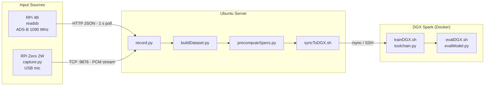

# Audio Classification of Aircraft

**WIP**

See [docs/workflow.html](https://jduanen.github.io/AircraftAudioId/workflow.html) for the full interactive workflow diagram.



## Hardware

### ADS-B Metadata Capture (Rpi4B)

See my [ADS-B Receiver Monitor](https://github.com/jduanen/ADSBMonitor) repo for the hardware used to generate the ADS-B metadata this project's training data.

### Flyover Audio Capture (RPi0-2W)

* Raspberry Pi Zero 2W with USB-C microphone
* see [Audio Capture Device](./audioCapture) for details

### ADS-B and Audio Processing (x86 Ubuntu Server w/ GPU)

* Ubuntu machine with i7-7820X, 128GB DRAM, and GTX2080
* ?

### Model Training and Inference (DGX Spark)

* DGX Spark: GB10 (128GB unified DRAM, 20x ARM CPU cores, Blackwell GPU)

## Software

The RPi0-2W is running Trixie and uses ntp to keep its clock synchronized with that of the server

The server is running Ubuntu on a deskside Intel CPU with 128GB of DRAM, and a GTX2080 GPU

### ADS-B Metadata Capture (RPi 4B)

See my [ADS-B Receiver Monitor](https://github.com/jduanen/ADSBMonitor) repo for the software used to generate the ADS-B metadata this project's training data

### Flyover Audio Capture (RPi Zero 2W)

* the `scripts/capture.py` script captures audio samples from the microphone, packetizes them, and sends them over a socket to the `scripts/record.py` script running on the server
* see [Audio Capture Device](./audioCapture) for details on the audio capture subsystem

### ADS-B and Audio Processing (x86 Ubuntu Server w/ GPU)

* **`scripts/record.py`**: runs the recording system that synchronizes and combines ADS-B and audio signals
  - uses `src/aircraftAudio/recorder.py` to coordinate the data from `readsb` and the RPi0-2W audio stream
  - e.g.,
```bash
python scripts/record.py \
    --lat <lat> --lon <lon> \
    --radiusKm <radius_km> \
    --maxAltitudeFt <alt_ft> \
    --outputDir <path> \
    --readsbUrl <url> \
    --nullSampleInterval <secs> \
    --nullSampleDuration <secs>
```
  - other options:
    * minAltitudeFt <alt_ft>: minimum aircraft altitude (default: ?)
    * sampleRate <Hz>: audio sample rate (default: ?Hz)
    * listenPort <portNum>: TCP port to receive Pi audio (default: ????)
    * postTriggerSecs <float>: seconds to keep collecting departure states after the save trigger fires (default: 10)
    * faaDatabaseDir <path>: path to unzipped FAA ReleasableAircraft directory — required for class-cap filtering
    * datasetCsv <path>: path to existing `dataset.csv`; loads current per-class clip counts at startup
    * maxSamplesPerClass <int>: skip recording aircraft whose coarse category already has this many clips in `dataset.csv`; requires `--faaDatabaseDir`; aircraft with unknown/foreign registrations are always recorded
  - **class-cap filtering**: when `--maxSamplesPerClass` is set, the recorder looks up each new aircraft's FAA category and skips it if that category is already at the cap; prints a `[cap]` line for each skipped aircraft at startup showing which classes are capped; counts are loaded from `--datasetCsv` at startup and do not update mid-session — restart with a fresh CSV after rebuilding the dataset to refresh counts

* **`scripts/buildDataset.py`**: reads recordings (meta)data and generates training dataset suitable for input to `toolchain.py`
  - e.g.,
```bash
python scripts/buildDataset.py \
    --recordingsDir <path> \
    --outputDir <path> \
    --faaDatabaseDir <path> \
    --autoCorrectClock \
    --maxCoTrackRatio <float> \
    --dropUnknown
```
  - other options:
    * maxPerClass <int>: cap each class at a given number (?)
    * clipSecs <float>: change clip length in secs (default: 5sec)
    * minDistanceKm <float>: filter out aircraft that are too close (can cause audio clipping)
    * maxDistanceKm <float>: filter out aircraft that are too far away to be heard clearly
    * trainFrac <float>: adjust ratio of train/val split (default: 0.8 -- i.e., 80/20)
    * clockCorrection <float>: manual global clock offset
      - only use if --autoCorrectClock option produces uniformly bad alignment
    * stratifyPhase: use the rarest bucket
      - e.g., (narrowbody_jet, approach), (narrowbody_jet, departure), (piston_single, approach), etc.
      - do this so every label ends up with equal approach and departure counts
      - without this, the existing per-label balancing is unchanged
    * balanceClasses: auto-balance to rarest class count; when downsampling, keeps the highest-RMS clips per class (loudest = best signal quality) rather than selecting randomly
    * skipExisting: skip recordings already in dataset.csv and merge new clips into the existing data — use this for incremental updates when new recordings have been added
  - this produces `dataset/train.csv` and `dataset/val.csv` which plug directly into toolchain.py's VehicleAudioDataset and reference the audio samples in `clips/`
  - `toolchain.py` expects 'filepath' (path to a 5-second clip WAV) and 'vehicle_types' (JSON list, e.g., ["B738"])
  - the generated CSV files contain: `directionClass` (0–7, from `headingDeg`), `velocityKts`, `distanceKm`, `clipRms` (RMS amplitude of the clip — used as a quality score when balancing classes)

* **`scripts/vizSpecs.py`**: visualize mel spectrograms from the dataset as a grid
  - loads from pre-computed `.spec.npy` files if available, otherwise falls back to librosa
  - e.g.,
```bash
# show a random 3×3 grid from the training set
python scripts/vizSpecs.py --csv dataset/train.csv

# show 12 helicopter clips in a 4-column grid
python scripts/vizSpecs.py --csv dataset/train.csv --category helicopter --n 12 --cols 4

# save to a PNG instead of displaying
python scripts/vizSpecs.py --csv dataset/train.csv --output specs.png

# interactive mode: click a spectrogram to play its audio (requires sounddevice + soundfile)
python scripts/vizSpecs.py --csv dataset/train.csv --play
```
  - options:
    * `--csv` (required): path to `train.csv` or `val.csv`
    * `--n` (default 9): number of clips to display
    * `--cols` (default 3): grid columns
    * `--category`: filter to a single coarse category (e.g. `helicopter`, `piston_single`)
    * `--seed` (default 42): random seed — change to see a different sample
    * `--output`: save to file instead of displaying
    * `--play`: enable click-to-play audio; clicking a spectrogram plays the corresponding WAV

* **`scripts/inspectDataset.py`**: provides a measure of the quantity, quality, and distribution of collected training/testing samples
  - this takes an inventory of the samples in the dataset and prints information about the data dataset described in `<recordingsDir>/../dataset/dataset.csv`.
  - e.g.,
```bash
python3 scripts/inspectDataset.py --recordingsDir <path>
```
  - other options:
    * datasetCsv <path>: path to dataset.csv (default: '<recordingsDir>/../dataset/dataset.csv')
    * maxQualityClips <int>: max clips to read for audio quality check (default: 200)
  - the information provided by this program includes:
    * number of Metadata files with matching WAV files and the number of missing WAV files
    * the number of single-aircraft and the number of multi-aircraft recordings
    * a histogram of durations of the recordings
    * a histogram of the distribution of distances of the sampled aircraft
    * a histogram with the percentages and absolute number of each class of aircraft
    * a histogram of the distribution of coarse labels
    * an indication of clock skew between the devices

* **`scripts/buildQualityDataset.py`**: builds a quality-filtered training dataset by keeping the best N clips per category
  - for each coarse category, clips are ranked by audio quality and the top N retained; the filtered set is re-split by flyover event into train/val CSVs; null/background samples are always kept
  - **Fast mode** (default): ranks by RMS dBFS from the `clipRms` column — no audio reads, runs in seconds
  - **Deep mode** (`--deepAnalysis`): ranks by composite quality score across all 7 audio metrics (same weights as `evalClipQuality.py`) — requires soundfile + librosa, reads every WAV
  - a clip is kept if it ranks in the top N for *any* of its categories (handles multi-aircraft clips correctly)
  - e.g.,
```bash
# Fast: keep best 500 clips per category (no audio reads)
python scripts/buildQualityDataset.py \
    --datasetCsv dataset/dataset.csv \
    --outputDir dataset_best/ \
    --bestN 500

# Deep: keep best 500 clips per category ranked by composite score
python scripts/buildQualityDataset.py \
    --datasetCsv dataset/dataset.csv \
    --outputDir dataset_best/ \
    --bestN 500 --deepAnalysis
```
  - options:
    * `--datasetCsv <path>` (required): full dataset CSV from `buildDataset.py`
    * `--outputDir <path>` (required): directory to write `train.csv` and `val.csv`
    * `--bestN <int>` (required): clips to keep per category; categories with fewer clips keep all
    * `--deepAnalysis`: rank by composite quality score instead of RMS
    * `--trainFrac <float>` (default: 0.8): fraction of flyover events for the training split

* **`scripts/buildQualityDatasetFromRecordings.py`**: extracts clips from raw recordings and keeps only the best N per category in a single pass
  - combines clip extraction (`buildDataset.py`) with quality filtering (`buildQualityDataset.py`) — use this when starting from `recordings/` rather than a pre-built CSV
  - e.g.,
```bash
# Fast: extract clips and keep best 500 per category by RMS
python scripts/buildQualityDatasetFromRecordings.py \
    --recordingsDir AircraftData/recordings \
    --outputDir dataset_best/ \
    --bestN 500 \
    --faaDatabaseDir AircraftData/ReleasableAircraft

# Deep: rank by composite quality score across 7 audio metrics
python scripts/buildQualityDatasetFromRecordings.py \
    --recordingsDir AircraftData/recordings \
    --outputDir dataset_best/ \
    --bestN 500 \
    --faaDatabaseDir AircraftData/ReleasableAircraft \
    --deepAnalysis
```
  - options:
    * `--recordingsDir <path>` (required): directory produced by `record.py` (contains `audio/` and `metadata/`)
    * `--outputDir <path>` (required): writes `clips/`, `dataset.csv`, `train.csv`, `val.csv`
    * `--bestN <int>` (required): clips to keep per category; categories with fewer clips keep all
    * `--faaDatabaseDir <path>`: FAA ReleasableAircraft directory — strongly recommended for correct category labels
    * `--deepAnalysis`: rank by composite quality score instead of RMS
    * `--clipSecs <float>` (default: 5.0): clip duration in seconds
    * `--trainFrac <float>` (default: 0.8): fraction of flyover events for the training split
    * `--maxDistanceKm <float>`: skip states where the aircraft is farther than this
    * `--dropUnknown`: exclude clips whose categories are entirely unknown
    * `--autoCorrectClock`: estimate per-recording clock skew from state timestamps
    * `--workers <int>` (default: 1): parallel workers for clip extraction

* **`scripts/evalClipQuality.py`**: evaluates audio clip quality per class using fast CSV-based metrics and optional deep per-file analysis
  - **Fast path** (no audio reads — uses pre-computed `clipRms` column in the CSV):
    * per-class table: mean/median/P10 RMS dBFS, % of clips below quality threshold, average distance and altitude
    * RMS histogram for the selected class
    * flight-phase breakdown (approach / closest / departure) for the selected class
  - **Deep path** (`--deepAnalysis` — reads each WAV file via soundfile + librosa):
    * silence fraction: fraction of samples with `|x| < 0.005`
    * clipping fraction: fraction of samples with `|x| > 0.99` (ADC saturation)
    * frame energy std dev: std dev of per-0.1s-frame RMS; low = flat noise with no distinct event
    * edge/center energy ratio: RMS of first+last 1 s ÷ RMS of middle 3 s; ratio > 1 = inverted energy envelope (misaligned or noise-only clip)
    * spectral flatness: 0 = tonal/structured, 1 = broadband noise
    * spectral centroid: frequency center of mass in Hz; very low (<300 Hz) = wind/rumble dominated
    * low-frequency energy ratio: fraction of spectral energy below 200 Hz; high = wind noise dominant
  - e.g.,
```bash
# Fast: all-class RMS summary (no audio reads)
python scripts/evalClipQuality.py --datasetCsv dataset/dataset.csv

# Fast: focus on one class with RMS histogram and phase breakdown
python scripts/evalClipQuality.py --datasetCsv dataset/dataset.csv --category piston_twin

# Deep: full analysis for weakest class, print 20 worst clips, export bad-clip list
python scripts/evalClipQuality.py \
    --datasetCsv dataset/dataset.csv \
    --category piston_twin \
    --deepAnalysis --worstN 20 \
    --outputBadClips bad_piston_twin.txt \
    --rmsThresholdDb -55

# Fast: keep 500 best piston_single clips by RMS (no audio reads)
python scripts/evalClipQuality.py \
    --datasetCsv dataset/dataset.csv \
    --category piston_single \
    --keepBestN 500 --outputBestClips best_piston_single.txt

# Deep: keep 500 best clips by composite quality score (all 7 metrics)
python scripts/evalClipQuality.py \
    --datasetCsv dataset/dataset.csv \
    --category piston_single \
    --deepAnalysis --keepBestN 500 --outputBestClips best_piston_single.txt
```
  - options:
    * `--category <name>`: coarse category to focus on (e.g. `piston_twin`); omit for all-class table only
    * `--deepAnalysis`: enable WAV-file analysis for silence, clipping, spectral, and temporal metrics
    * `--maxClips <int>`: cap the number of clips analysed in deep mode (randomly sampled, seed=42)
    * `--worstN <int>`: number of lowest-RMS clips to print in the worst-clips table (default: 20)
    * `--outputBadClips <path>`: write one filepath per line for all clips below `--rmsThresholdDb`
    * `--rmsThresholdDb <float>`: dBFS threshold for "low quality" (default: −55)
    * `--keepBestN <int>`: select the N highest-quality clips for the selected class and write their paths to `--outputBestClips`. Requires `--category` and `--outputBestClips`. Without `--deepAnalysis`, ranks by RMS only; with `--deepAnalysis`, ranks by a weighted composite score across all seven metrics (see table below).
    * `--outputBestClips <path>`: output file for `--keepBestN` results; one filepath per line
  - **Composite quality score** (used by `--keepBestN --deepAnalysis`): each metric is normalised to [0, 1] (1 = best) and combined with the following weights:

    | Weight | Metric | Direction |
    |---|---|---|
    | 0.35 | RMS dBFS | higher = louder aircraft |
    | 0.15 | Silence fraction | lower = fewer silent gaps |
    | 0.10 | Clipping fraction | lower = no ADC saturation |
    | 0.10 | Spectral flatness | lower = more tonal / structured |
    | 0.10 | Edge/center ratio | lower = energy centred on flyover apex |
    | 0.10 | Low-freq energy ratio | lower = less wind/rumble |
    | 0.10 | Spectral centroid | penalise < 300 Hz (wind) and > 4000 Hz (noise) |
  - **Choosing a dBFS threshold**: the script uses dBFS (decibels full-scale, relative to the ADC clipping point — not dBm). A clip is useful only when the aircraft signal is clearly above the ambient noise floor; aim for at least 10–15 dB of headroom above background. Typical reference points for a USB mic recording outdoors:
    * −20 to −35 dBFS: loud, close aircraft — ideal
    * −35 to −50 dBFS: moderate distance — usually usable
    * −50 to −60 dBFS: distant/quiet — borderline; may be mostly noise
    * below −60 dBFS: almost certainly inaudible over ambient noise
  - To calibrate the threshold for your setup, run the fast path first (`--datasetCsv` only) and inspect the P10 column. Set `--rmsThresholdDb` just above the level where clips stop sounding like aircraft and start sounding like wind or silence. Listening to a handful of clips at −50, −55, and −60 dBFS from your recordings takes only a few minutes and gives a concrete answer.
  - **Interpreting deep analysis metrics**: each metric flags a different failure mode; read them together rather than in isolation.

    | Metric | Good | Warning | Bad |
    |---|---|---|---|
    | Silence % | < 10% | 10–30% | > 30% — large gaps, aircraft may have already passed |
    | Clipping % | ≈ 0% | > 0.1% | > 1% — ADC saturation, spectral detail destroyed; reduce mic gain |
    | Frame energy std | high | — | near 0 — temporally flat; ambient noise with no flyover event |
    | Edge/center ratio (ECR) | < 1.0 | ≈ 1.0 | > 1.5 — inverted envelope; clip misaligned or captures only the tail/head of the flyover |
    | Spectral flatness | < 0.2 | 0.3–0.6 | > 0.6 — broadband noise dominant; does not sound like an aircraft |
    | Spectral centroid | 600–2000 Hz (piston), 300–1000 Hz (jet) | — | < 300 Hz = wind/rumble dominant; > 4000 Hz = interference or mic noise |
    | Low-freq ratio | < 25% | 25–50% | > 50% — sub-200 Hz energy dominant; almost always wind noise |

  - **Common failure patterns** (combinations that indicate a bad clip):

    | Pattern | Likely cause |
    |---|---|
    | Low RMS + high flatness + low frame-energy std | Ambient noise — no aircraft event captured |
    | High silence % + low frame-energy std | Aircraft too brief or already gone when clip was cut |
    | Low RMS + high LF% + low centroid | Wind noise dominating the clip |
    | Good RMS + high clipping % | Mic gain too high or aircraft too close |
    | ECR > 1.5 + good RMS | Clip misaligned — aircraft was loudest at the edges of the window |
    | Low RMS + low flatness + centroid 500–1500 Hz | Distant but real aircraft — may still be trainable |

  - **Filtering recommendation**: discard clips with *at least two* flags simultaneously (e.g. RMS < −55 dBFS AND flatness > 0.5 AND LF% > 50%). Single-metric outliers are often just distant aircraft and may still contribute useful training signal.

* **`scripts/icaoLookup.py`**: list unique ICAO24 hex codes seen across all recorded metadata, with optional sample counts, track counts, and FAA registration details
  - e.g.,
```bash
# basic list of codes and most-common callsigns
python3 scripts/icaoLookup.py --recordingsDir ./recordings

# with raw sample count and per-track sighting count
python3 scripts/icaoLookup.py --recordingsDir ./recordings --counts --tracks

# with FAA registration info, sorted by most-recorded
python3 scripts/icaoLookup.py --recordingsDir ./recordings --counts --tracks \
    --faa --faaDatabaseDir ./data/ReleasableAircraft --sortBy samples

# with extended FAA fields
python3 scripts/icaoLookup.py --recordingsDir ./recordings --counts --tracks \
    --faa --faaDatabaseDir ./data/ReleasableAircraft \
    --fields nNumber,manufacturer,model,typeAcft,typeEng,noEngines,noSeats
```
  - options:
    * `--counts`: show raw sample count (total number of ADS-B state entries per code)
    * `--tracks`: show per-track sighting count
    * `--trackInterval <hours>` (default 1.0): minimum gap in hours between recordings to count as a new track
    * `--faa`: show FAA registration info (requires `--faaDatabaseDir`)
    * `--faaDatabaseDir <path>`: path to unzipped FAA ReleasableAircraft directory
    * `--fields <list>` (default: `nNumber,manufacturer,model,category`): comma-separated FAA fields; available: `nNumber`, `manufacturer`, `model`, `category`, `typeAcft`, `typeEng`, `noEngines`, `noSeats`
    * `--sortBy` (default `icao24`): sort by `icao24`, `samples`, `tracks`, or `callsign`
  - **CALLSIGN** is the most frequently seen callsign for each code (stable for N-number aircraft; varies for airline flights)
  - foreign registrations not in the FAA database show blank FAA columns

### Model Training (DGX Spark)

Training runs inside a Docker container on the DGX Spark using scripts in `scripts/`. All commands below are run from the Ubuntu recording server unless noted.

* Phase 1: Classify by vehicle type (multi-label)
  - coarse category labels: `piston_single`, `piston_twin`, `turboprop`, `helicopter`, `business_jet`, `regional_jet`, `narrowbody_jet`, `widebody_jet`
  - model: two backbone options via `--backbone`:
    - `resnet18` (default): ImageNet-pretrained ResNet-18, dual-channel mel spectrogram input (channel 0: 0-8kHz, channel 1: 8kHz-Nyquist, each with the full 128-mel resolution budget — see `DESIGN_NOTES.md`), SpecAugment
    - `panns` (recommended): frozen AudioSet-pretrained PANNs CNN14 embeddings (2048-dim, precomputed) + MLP head. AudioSet includes aircraft/helicopter/jet-engine/propeller classes, so the features transfer far better than ImageNet
  - both use a multi-label sigmoid head, BCEWithLogitsLoss with pos_weight balancing, dropout 0.5
  - code: `src/aircraftClassifier/training/toolchain.py` (`VehicleAudioDataset` + `VehicleSoundClassifier`)

```bash
# Sync project + dataset to DGX
bash scripts/syncToDGX.sh spark-8d0d.local

# Pre-compute spectrograms once (or after adding new clips)
bash scripts/precomputeDGX.sh

# Train (basic)
bash scripts/trainDGX.sh --useCategories

# Train with backbone freezing to combat overfitting (recommended for small datasets)
bash scripts/trainDGX.sh \
    --useCategories \
    --freezeBackbone \
    --weightDecay 0.05 \
    --maxEpochs 60 \
    --patience 20

# Train on PANNs embeddings (recommended): build the image once (adds panns-inference),
# precompute embeddings, then train the MLP head
bash scripts/buildImageDGX.sh                    # first time only, or after Dockerfile.training changes
bash scripts/precomputeEmbeddingsDGX.sh          # writes <clip>.panns.npy sidecars
bash scripts/trainDGX.sh \
    --useCategories \
    --backbone panns \
    --weightDecay 0.05 \
    --maxEpochs 60 \
    --patience 20

# Evaluate a checkpoint
bash scripts/evalDGX.sh \
    --checkpoint /checkpoints/best.ckpt \
    --labelEncoder /checkpoints/labelEncoder.json \
    --valCsv dataset/val.csv \
    --useCategories --tuneThresholds
```

  **Backbone selection:**
  - `--backbone panns`: trains an MLP head (2048→512→256→nClasses) on precomputed PANNs embeddings. Requires `scripts/precomputeEmbeddings.py` (or `precomputeEmbeddingsDGX.sh`) to have been run first — training fails with a clear error if a `.panns.npy` sidecar is missing. `--freezeBackbone`/`--unfreezeEpoch`/`--compile` do not apply in this mode (the PANNs backbone is frozen offline); waveform augmentation and SpecAugment also do not apply. Epochs are very fast since inputs are 2048-dim vectors.

  **Overfitting controls** (all passed via `trainDGX.sh`):
  - `--freezeBackbone`: freeze conv1 through layer3; only layer4 + classifier are trained (~8.5M trainable, ~2.8M frozen). Strongest single lever for small datasets — prevents the backbone from memorizing training examples.
  - `--unfreezeEpoch N`: at epoch N, unfreeze the full backbone for end-to-end fine-tuning. The cosine LR schedule has decayed by then, so fine-tuning is gentle. For a 60-epoch run, use 30 (halfway point). Omit entirely if the dataset is small — full backbone fine-tuning on <500 clips/class causes severe overfitting (train/val loss ratio >10×).
  - `--patience N`: EarlyStopping patience in epochs (default: 10). When using `--freezeBackbone` with `--unfreezeEpoch`, set patience higher than unfreezeEpoch (e.g., `--patience 45` for `--unfreezeEpoch 30`) so early stopping cannot fire before the backbone unfreezes.
  - `--weightDecay`: AdamW L2 penalty (default: 0.01). Increase to 0.05–0.1 for additional regularization.
  - `--minClipsPerClass N`: drop classes with fewer than N clips in the **val set** before building the label encoder. Classes below the threshold are excluded from training entirely — they are not learnable and poison val_f1 by contributing undefined recall to macro averaging. Counts against val (not combined) because a class with 0 val samples causes the warning even if it has many train clips. Prints a list of dropped classes at startup. Recommended: 10–20 (enough val samples for a stable F1 estimate).
  - `--noPosWeight`: disable automatic pos_weight balancing (not recommended unless the dataset is already balanced).

  **Class imbalance and val_loss:**
  pos_weight compensates for class imbalance in BCEWithLogitsLoss, but extreme ratios cause val_loss to blow up — a single wrong prediction on a 100× weighted class dominates the loss. Two mitigations are applied:
  - **pos_weight cap lowered to 10** (was 100). Classes with fewer clips than ~10% of the majority class should be addressed by collecting more data (via `record.py --maxSamplesPerClass`), not by extreme loss weighting. `computePosWeight` in `toolchain.py` enforces this cap.
  - **Balance the dataset before training** using `buildDataset.py --balanceClasses --maxPerClass N`. Capping the dominant class (e.g., `piston_single`) at a reasonable multiple of the rarest class reduces pos_weight values organically and makes the model see a more realistic distribution per batch. A class with fewer than ~200 clips is effectively unlearnable and should be excluded or merged until more data is collected.

## Workflow Steps

1) Set up ADS-B capture device
  * Hardware
    - Rpi4B with two SDR dongles, RF splitter, and a dual-mode (1090/9??MHz) antenna
    - ?
  * Software
    - run `readsb` ????
    - make sure clock is synchronized with NTP
      * `timedatectl status`  # indicates whether NTP service is active
    - ?

2) Evaluate and select microphone and ADC
  * use scripts/evalMics.py to select microphone and ADC
  * ????

3) Set up audio capture device
  * Hardware
    - RPi0-2W with ???? ADC and ???? microphone
    - ???? rechargeable battery pack and ???? solar panel
    - waterproof enclosure
    - microphone wind screen
    - ?tower?
  * Software
    - make sure clock is synchronized with NTP
      * `timedatectl status`  # indicates whether NTP service is active
    - ????
```bash
python3 ./scripts/capture.py --host <serverIPA>
```

4) Set up server to gather ADS-B metadata and audio data
  * Hardware
    - ?
  * Software
    - receive ADS-B metadata from Rpi4B and audio samples from RPi0-2W and put them into .recordings/????
    - ?
```bash
python3 scripts/record.py \
      --lat <lat> \
      --lon <lon> \
      --radiusKm 8 \
      --outputDir ./recordings \
      --readsbUrl http://adsbrx.lan/tar1090/data/aircraft.json \
      --nullSampleInterval 90 --nullSampleDuration 10 \  # saves a 10 sec background clip every 1.5 mins when no aircraft is in range
      --maxNullSamples 500  # stop saving null clips once 500 exist; counts existing files so safe to use when resuming
```

5) Build training and validation dataset
  * ?sync metadata to audio, correct for clock skew,  generate splits, and write out dataset
    - use scripts/buildDataset.py to produce 'dataset/train.csv', 'dataset/val.csv', and 'dataset/clips/\*.wav'
```bash
python3 scripts/buildDataset.py \
      --recordingsDir ./recordings \
      --outputDir ./dataset \
      --faaDatabaseDir ./data/ReleasableAircraft \
      --autoCorrectClock \
      --maxCoTrackRatio 2.0 \  #### TODO figure out good value for this
      --maxDistanceKm 4.0 \
      --dropUnknown \
      --stratifyPhase \
      --balanceClasses  # auto-balance to rarest class count, or --maxPerClass 200  # cap each class at a given number
```
    - defaults to 5sec clips, 80% train and 20% validate, ????
  * balance classes, get ~1000 samples per class (including null cases)
    - ?

6) Pre-compute mel spectrograms
  * Saves a `<clip>.spec.npy` file alongside each WAV in `dataset/clips/`. Training loads these directly instead of computing spectrograms on the fly, which avoids a CPU bottleneck in the DataLoader.
  * Run once after building the dataset, and again whenever new clips are added.
  * Also **run again (without `--skipExisting`) whenever the mel config in `toolchain.py` changes** (`N_FFT`/`HOP_LENGTH`/`N_MELS`/`FMAX`) — there is no staleness check, so stale `.spec.npy` files from an old config are loaded silently.
  * On the recording server (CPU only, no GPU needed):
```bash
python scripts/precomputeSpecs.py \
    --trainCsv dataset/train.csv \
    --valCsv dataset/val.csv \
    [--workers 16]        # parallelism; default 16
    [--skipExisting]      # skip clips that already have a .spec.npy; default is to recompute all
```
  * On the DGX Spark (inside the training Docker image):
```bash
bash scripts/precomputeDGX.sh
```
  * The `.spec.npy` files are written alongside the WAVs and are included in the rsync to the DGX. Training falls back to computing spectrograms via librosa at runtime if a `.npy` file is missing.
  * For `--backbone panns`, pre-compute PANNs embeddings instead (GPU recommended; run on the DGX). Writes a `<clip>.panns.npy` (2048-dim) sidecar alongside each WAV. There is no runtime fallback — training errors if a sidecar is missing:
```bash
bash scripts/precomputeEmbeddingsDGX.sh [--skipExisting]
```
  * The PANNs CNN14 checkpoint (~300 MB) is cached on the DGX host at `~/panns_data` and mounted into the container, so it downloads once.

7) Verify dataset quality and quantity
    - run test to check dataset
    - check the quality, class distribution (including null cases), and sampling context distribution of the dataset
      * want to be sure we have sufficient labeled examples of each category, under different capture circumstances (e.g., weather, time-of-day, etc.), and that there are approximately the same number of examples for each category
```bash
python scripts/inspectDataset.py --recordingsDir ./recordings --datasetCsv ./dataset/dataset.csv
```

8) Set up DGX Spark to train the models
  * Training runs inside `aircraft-audio-training:latest` (built from `docker/Dockerfile.training`)
  * The image is built automatically by `trainDGX.sh` on first run and skipped on subsequent runs; pass `--build` to force a rebuild (only needed when `Dockerfile.training` changes)
  * PyTorch hub weights (e.g. ResNet-18) are cached on the DGX host at `~/.cache/torch` and mounted into the container, so they are not re-downloaded on each run
  * Checkpoints land in `./checkpoints/` on the DGX host
  * The NVIDIA persistence daemon must be running or GPU containers will fail to start:
```bash
sudo systemctl enable --now nvidia-persistenced
```

9) Training
  * Phase 1: classify by propulsion type, engine count, and wing type
```bash
bash scripts/syncToDGX.sh spark-8d0d.local

# PANNs embeddings + MLP head (recommended; precompute embeddings first, see step 6)
bash scripts/trainDGX.sh \
    --useCategories \
    --backbone panns \
    --weightDecay 0.05 \
    --maxEpochs 60 \
    --patience 20

# or: ResNet-18 on mel spectrograms with backbone freezing
bash scripts/trainDGX.sh \
    --useCategories \
    --freezeBackbone \
    --weightDecay 0.05 \
    --maxEpochs 60 \
    --patience 20
```
  * Pass `--build` to `trainDGX.sh` to force a Docker image rebuild (only needed when `Dockerfile.training` changes). The image is built automatically on first run and skipped on subsequent runs.
  * Phase 2: direction of travel (8 cardinal directions) — not yet implemented
  * Phase 3: speed estimation — not yet implemented

10) Evaluation
```bash
bash scripts/evalDGX.sh \
    --checkpoint /checkpoints/best.ckpt \
    --labelEncoder /checkpoints/labelEncoder.json \
    --valCsv dataset/val.csv \
    --useCategories --tuneThresholds \
    [--saveThresholds /checkpoints/thresholds.json]
```
  - prints per-class AP, F1, precision, recall, and support; macro mAP and F1 summary
  - the backbone (resnet18 or panns) is read from the checkpoint automatically; panns checkpoints evaluate against the `.panns.npy` sidecars
  - `--saveThresholds` writes the tuned per-class thresholds to a JSON file (`{"class": threshold, ...}`) for inference to load
  - `scripts/evalBestDGX.sh` finds the checkpoint with the highest val_f1 (parsed from its filename, e.g. `epoch=16-val_f1=0.451.ckpt`) and runs `evalDGX.sh` on it, so you don't have to `ls -lt checkpoints/` and copy a filename by hand:
```bash
bash scripts/evalBestDGX.sh \
    --labelEncoder /checkpoints/labelEncoder.json \
    --valCsv dataset/val.csv \
    --useCategories --tuneThresholds \
    [--saveThresholds /checkpoints/thresholds.json]
```

11) Inference
  - ?

## Design Notes

See [Link to design notes](DESIGN_NOTES.md)

## TODO

1. Direction and speed heads are not implemented (Objectives 2 & 3)
  * 'VehicleAudioDataset.__getitem__' (toolchain.py:128) returns (spec, typeLabel), but no 'directionClass' or 'velocityKts'
  * 'VehicleSoundClassifier' has only one output head (multi-label type)
    - the CSV carries the labels but training ignores them, so objectives 2 and 3 are currently unaddressed
  * the CLAUDE.md architecture already specifies three heads with masked loss for direction/speed on single-vehicle samples
    - have to implement the other heads for the other phases

2. Data leak: simultaneous aircraft produce overlapping recordings with different recordingIds
  * in recorder.py, when two aircraft both hit the departure trigger in the same poll, '\_saveRecording' is called twice back-to-back (lines 188–222)
    - each writes a WAV reading from the same circular buffer
    - the audio windows overlap heavily, but the 'recordingId' is {timestamp}\_{icao24} so they look like independent events
  * splitByEvent (clipExport.py:327) splits on recordingId, so nearly-identical audio can land on both sides of the train/val split, resulting in leakage
    - fix: when multiple aircraft trigger save in the same window, emit one recording with both aircraft as a multi-label annotation
      * or group by timestamp prefix in splitByEvent

3. 'typeToCategory' heuristic produces wrong labels for common cases
  * 'typeCategories.py':252 falls back on "piper" → piston_single, but a Piper Meridian is a turboprop and a Piper Malibu exists in both piston and turboprop variants
  * the FAA database (faaDatabaseDir) is authoritative and optional
    - it should be the default path, and 'typeToCategory's' keyword heuristic should only be a fallback for foreign/unknown ICAO24s
  * currently users who forget '--faaDatabaseDir' will silently get bad training labels

4. ImageNet ResNet is suboptimal for audio; PANNs/AST code exists but is unused
  * 'toolchain.py' uses ResNet-18 with ImageNet weights, with conv1 replaced by a fresh 1-channel layer
    - this results in losing the pretrained stem entirely
  * 'src/aircraftClassifier/pretrained' has PANNs and AST integration written but unused
    - PANNs (pretrained on AudioSet, which includes aircraft sounds) typically give a 10–20% F1 lift over ImageNet-initialized CNNs on small aviation datasets
  * this is the single highest-leverage change that can be made

5. AircraftDatabase.getAircraftType blocks on HTTP inside the recording save path
  * 'recorder.py':299 → 'typeDb.getAircraftType(icao24)' synchronously hits OpenSky during '\_saveRecording', which runs in the single monitoring thread
    - a slow OpenSky response delays the save and can make you miss fast-moving aircraft on the next poll
  * fix: move the lookup out of the hot path
    - resolve types lazily in buildDataset.py or via a background thread that pre-populates the cache

6. ~~Mel spectrogram is computed on CPU, per-sample, in the DataLoader~~ — **resolved**
  * `scripts/precomputeSpecs.py` pre-computes and caches `<clip>.spec.npy` alongside each WAV
  * `VehicleAudioDataset.__getitem__` loads `.npy` directly; SpecAugment is applied at load time for the training set

7. ~~No inference/evaluation tooling~~ — **resolved**
  * `scripts/evalModel.py` provides per-class AP/F1/precision/recall table, optional per-class threshold tuning, and single-WAV inference
  * `scripts/evalDGX.sh` runs it inside the training Docker image on the DGX Spark

8. Null samples are not being used for background noise augmentation
  * null (aircraft-free) clips are collected but '--bgNoiseDir' is only a manual opt-in
  * the null-clip directory in 'recordings/' is already the ideal 'bgNoiseDir'
  * Fix: auto-wire it or document the flow
    - 'AddBackgroundNoise' is the single highest-impact augmentation for this task (per the doc comment in audioAug.py:7)

9. MAX_SEEN_POS_SECS = 30 is too permissive for direction labels
  * 'readsb.py':19 keeps positions up to 30s stale
    - a jet at 400 kts moves ~6 km in 30s
  * the recorded 'headingDeg/bearingDeg' at save time could be grossly wrong
  * for direction training (Objective 2), tighten this to ~5s and drop clips whose seenSecs > 5 in 'buildDataset.py'
                                                                                                                                                                                                                     
10. 'directionClass' semantics are ambiguous
  * 'clipExport.py':81 quantizes the aircraft's absolute compass heading, but "direction of travel" from the observer's ear depends on bearing × heading together
    - a northbound aircraft passing east-of-you at 1 km sounds very different from a northbound aircraft passing
  west-of-you at 1 km
  * consider a relative-motion label (e.g. heading-minus-bearing quantized to 8 bins, or Doppler sign) rather than absolute heading.

11. vehicle_types is always a single-element list
  * 'clipExport.py':219: `vehicleTypes = [aircraftType] if aircraftType else []`
    - co-tracked aircraft types are discarded
  * for Objective 4 (i.e., multi-aircraft), co-tracked aircraft's types should appear in vehicle_types of each other's clips (or clips should be shared)
    - this undercuts the multi-label framing
12. Inline model re-implemented; library version ignored
  * 'src/aircraftClassifier/models/resNetCNN.py' defines the same architecture that 'toolchain.py' re-implements inline (currently ResNet-18)
  * fix: either delete the unused file or route training through it
    - only 'toolchain.py' + 'augmentation/audioAug.py' are imported from the classifier package

13. '--useCategories' should default to 'True'
  * the whole dataset pipeline is designed around categories (typeCategories.py, FAA lookup, type_categories column)
    - but 'toolchain.py':212 defaults to the raw 'vehicle_types' strings
    - this creates a class per variant (e.g., 737-800, 737-8H4, 737-824 as separate classes)
  * This will never train well
    - fix: make '--useCategories' default on, or rename to '--rawTypes' with default off

14. Differential learning rates
  * 'toolchain.py':197: single AdamW LR for the whole network
  * the replaced conv1 and the fresh classifier head have no pretraining
    - applying the same 1e-4 means they barely move
  * fix: use parameter groups with ~5–10× higher LR on new layers

## Recommendations
* PANNs vs AST vs. ResNet backbone
  - PANNs (CNN14): Drop-in swap
    * 'panns-inference' gives you a pretrained CNN14 trained on 2M AudioSet clips
      - You strip its final layer and attach your classifier head
    * low risk, probably +10–20% F1 over ImageNet ResNet
      - the code in 'pretrained/'' is already written
    * main downside: CNN14 expects 64-mel by default, your pipeline uses 128-mel, so you'd either adapt the input or re-derive embeddings
  - AST (Audio Spectrogram Transformer): State-of-art but transformer training dynamics are different
    * needs warmup, smaller LR, more data to not overfit
    * downsides
      - on a small dataset it can underperform a well-regularized CNN
      - harder to get right
  - recommendation: swap to PANNs CNN14 now
    * it's highest bang-for-buck before you have a large dataset
    * once you have 10k+ clips, re-evaluate AST
    * the question before implementing:
      - do you want to adapt the existing 128-mel pipeline to match CNN14's expected input, or use a different mel config?
      - CNN14 was trained with 64 mels / 1024 FFT / 320 hop at 32kHz, but the pretrained weights are flexible about input shape since
   the classifier head is replaced

* Direction and speed heads questions
  A) Do you have enough labeled single-aircraft clips?
    - direction and speed heads only backpropagate on 'isSingle'=1 samples
    - if most of your recordings so far are jets at altitude with co-tracked traffic, these heads will barely train
      * worth checking via 'inspectDataset.py' first
  B) what should 'directionClass' mean?
    * currently it's the aircraft's absolute compass heading (e.g. 045° → class 1 = NE)
    * but from an audio perspective, a plane heading NE while passing to your north sounds identical to a plane heading NE while passing to your south
      - same Doppler and same engine spectrum
    * the aurally meaningful label is the aircraft's heading relative to you, not its absolute heading
    * the data to compute this already exists
        - 'headingDeg and bearingDeg' are both in the CSV
    --> changed definition in code
